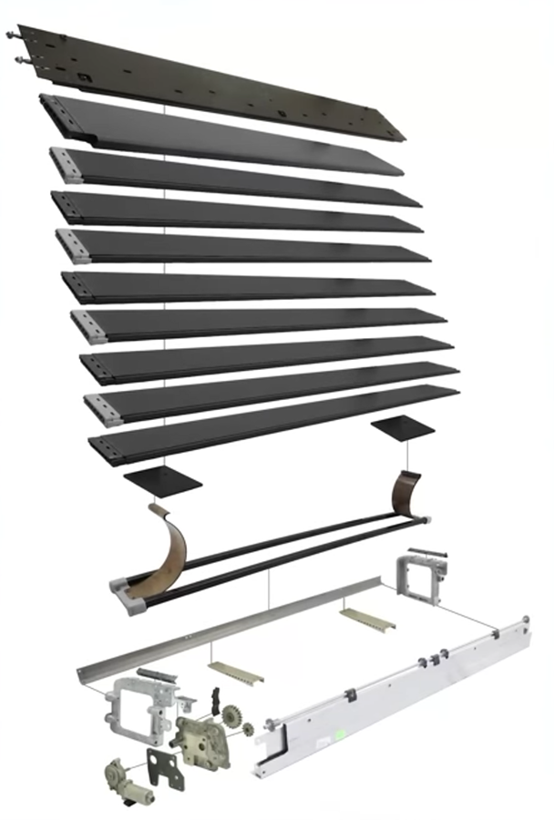
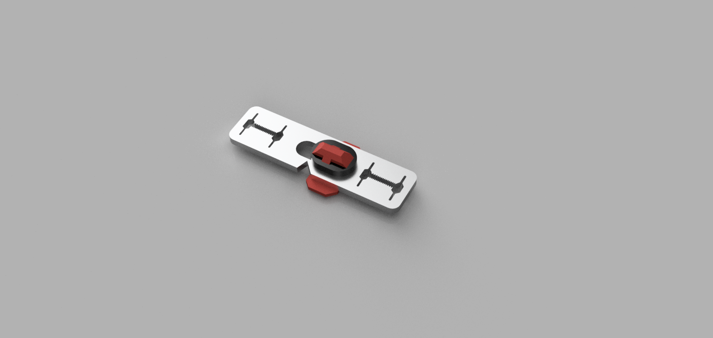
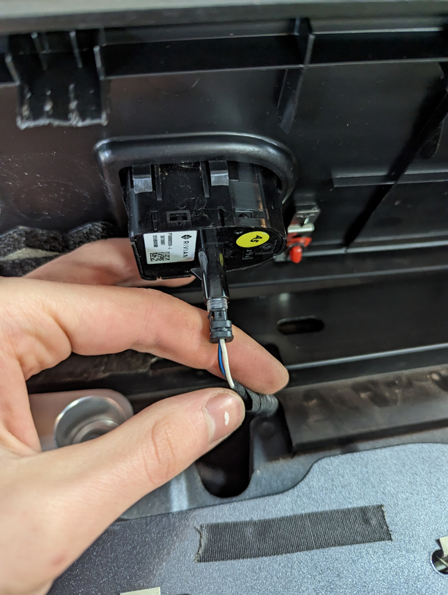
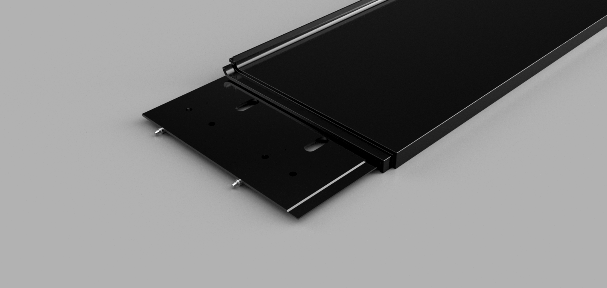
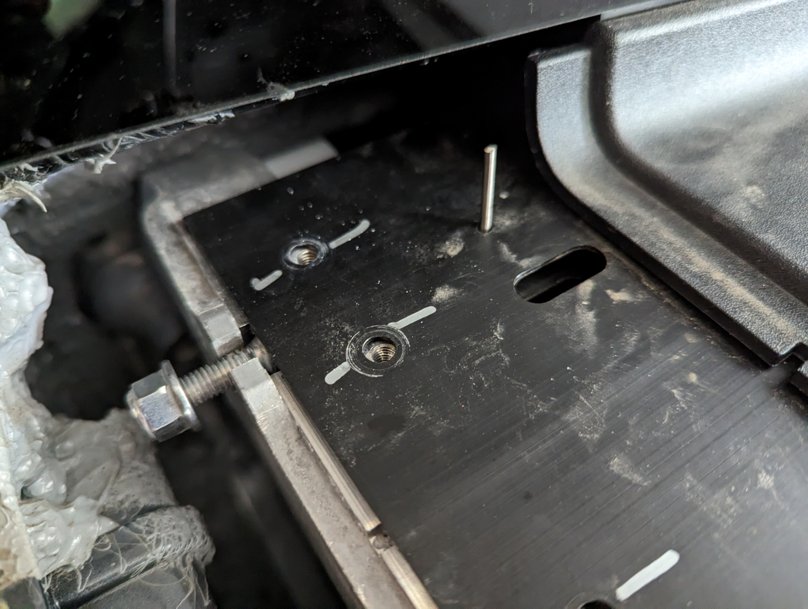
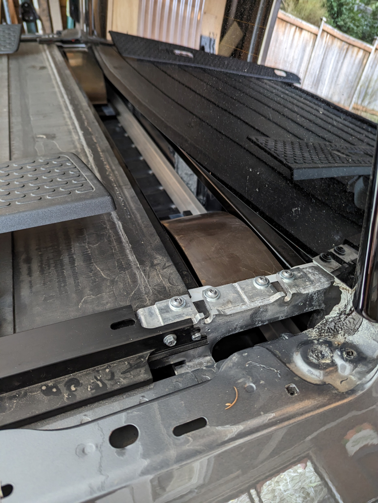

# DIY Tonneau Cover Repair
The tonneau cover on the Rivian R1T is composed of 8 metal slats that interlock. The slats travel down guide rails with an inner plastic guide. The slats are stored in a small compartment below the rear window; they are pushed upwards by two springs and propelled in and out with a single motor. I would recommend checking out [this video](https://www.youtube.com/watch?v=1V7e0JWe0Ks) from Sandy Munro for more information on how the system works before you begin.

If a panel becomes misaligned, it can become wedged within the guide rails and will usually chew up the plastic insert. When this occurs, the insert will need to be replaced.

Image credit: https://www.youtube.com/watch?v=1V7e0JWe0Ks

## Accessing the Tonneau Storage Compartment
To access the tonneau storage compartment, you will need to remove the following pieces:
- Bed side trim (x2)
- Window side trim (x2)
- Tonneau compartment cover

The bed side trim is held in place by several plastic clips. Some of the clips are these red clips, and others are a black plastic clip. Pull directly up on the trim to remove it - it is likely that some of the black clips will break. Be sure not to pull the trim up more than a few inches, since the cables for the gear tunnel release and tonneau/tailgate button are attached to the trim.

Once removed, disconnect the buttons from the trim. There is no locking mechanism, so you can simply pull to disconnect the buttons. Try not to pull on the cable, as this could damage the connector.

Next, remove the window side trim. This is held in place by several of the red clips, and a few plastic guide pins. Pull up and out to remove this trim.

Lastly, remove the tonneau compartment cover. This is the most difficult piece to remove. While it is tempting to try to remove the plastic cover, it is screwed into the metal plate and will not come off. Instead, you will need to remove the whole metal plate. This is held in place by 8 screws, 4 on each side. Be careful not to damage the rear window during this process. Also, note that there is a washer for each of these screws underneath the plate - try not to lose them. Next, there are 4 bolts that are connected to either end of two metal rods. Remove these bolts, and then the metal rods will slide out. The metal plate should now be free to remove.

Hint: If the rods are spinning, you can insert a small pin into the hole on the left side of the metal plate. This will stop the rods from spinning.

You should now have access to the tonneau storage compartment. If any panels are misaligned, you may be able to remove and reinsert them.

